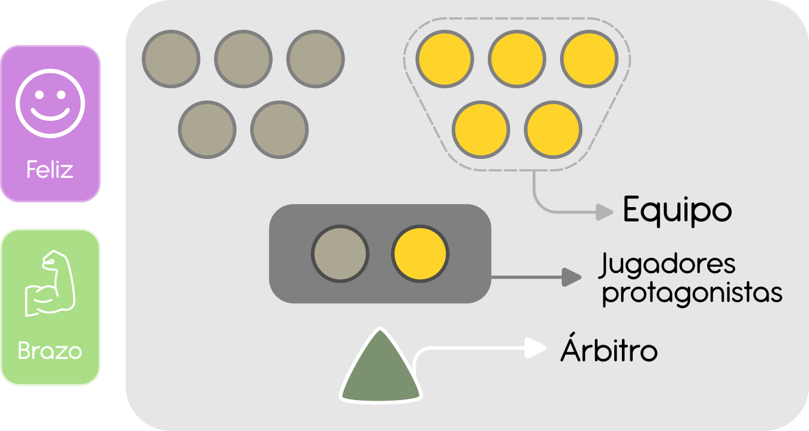

<!-- 
To-do:

[Imprescindible]
* Agregar Introducción
* Agregar EDT
* Agregar Investigación realizada (Sincerar faltas!) [Trincado]
* Agregar Principios de selección @ Propuesta de diseño

[Necesario]
* Agregar contexto del problema (Revisar la parte del problema, lo del ramo ta bn)
* Revisar necesidades del usuario
* Modificaciones al EDT
* Arreglar fotos corridas

[Deseable]
* Redacción/ortografía
* Revisar títulos de referentes
* Revisar títulos de ideas proyectuales
* Por favor, cambiemos el nombre de la Posta Emocional

[Si sobra tiempo]
* Rehacer la matriz Pugh (Esta incoherente)

-->

<!-- Historial de revisión -->

\pagebreak
\tableofcontents
\pagebreak

# Contexto del problema
Este proyecto es parte de la asignatura Taller VI de la carrera
Ingeniería en Diseño de Productos, de la UTFSM. Esta asignatura es, a su vez, 
una continuación del trabajo realizado en Taller V; en el cual los estudiantes
determinaron necesidades existentes dentro de la *Escuela Especial de 
Desarrollo de La Reina* (En adelante, *La Escuela*), un establecimiento educacional 
diferencial de organización municipal situado en la ciudad de Santiago. 

El objetivo de Taller VI es reconocer, y desarrollar nuevas soluciones en
el área de inclusión; utilizando a *La Escuela* como espacio de investigación
y testeo. 
 *La Escuela* fue generosa a la hora de compartir sus actividades, experiencias, conocimientos,
y disponibilidad de sus alumnos y profesores para deasarrollar este proyecto.

Luego de una extensa investigación sobre el usuario y sobre los dolores que experimentan y, considerando además la reciente pandemia de Covid-19, se hizo evidente el deseo de mejorar la salud mental de los alumnos de la escuela para, de esta forma, ayudar en su desarrollo personal y propiciar mejores posibilidades a la hora de integrarse a la sociedad. A esto se le suma que las personas con autismo tienen cuatro veces más posibilidades de desarrollar depresión que la población general. Debido a que es una enfermedad crónica es sumamente importante la intervención temprana para evitarla. De todo esto nace nuestro problema: Los adolescentes TEA tienen dificultad para desarrollar herramientas sanas de afrontamiento emocional, haciéndolos más propensos a la ansiedad y la depresión.

<!-- Falta contexto del problema -->

# Equipo de trabajo
El equipo consta de cuatro individuos:

 - **Andrés Hechenleitner:** Implementador. Actúa simultáneamente como
   líder de Investigación Aplicada, y mantenedor de documentación.
   
 - **Luciano Roque:** Cohesionador. Actúa como encargado de
   Secretaría, y Comunicaciones.
   
 - **Vicente Trincado:** Especialista. Líder de investigación básica,
   y redacción de documentación.
   
 - **Ricardo Valdés:** Monitor Evaluador. Es el evaluador principal
   del proyecto, participa en todas las esferas para velar por la
   buena ejecución del proyecto. Además es líder de investigación
   secundaria.
<!-- WIP -->

# Objetivos del proyecto
El actual proyecto nace a partir de los deseos del equipo de continuar
estudiando la base de usuarios observada en el taller pasado; a saber, 
niños TEA de enseñanza básica. Y a la vez, estudiar estudiar aspectos
de bienestar emocional.

Definimos, entonces, los objetivos del proyecto de la siguiente forma:

## Objetivo General

> Mejorar la convivencia en recreo entre niños con TEA, para mejorar su
> bienestar emocional a través de actividades de juego.

## Objetivo Específico 1

> Desarrollar actividades de juego que propicien el alfabetismo en
> salud mental en niños.
 
## Objetivo Específico 2

> Brindar herramientas que faciliten dinámicas de interacción social
> enriquecedora en recreo.
 
## Objetivo Específico 3

> Desarrollar reconocimiento emocional propio desde la propiocepción,
> y la cinestesia; a través del juego en recreo.

# Entregables de trabajo
<!-- WIP -->

# Investigación realizada
La investigión realizada hasta a la fecha ha tenido el objetivo de
determinar concretamente el perfil de usuario, y sus respectivas
necesidades. En el camino también fue posible aprender, y en
consecuencia, refinar nuestros objetivos específicos para resolver
mejor el problema de diseño.[^obj-esp3-old]

[^obj-esp3-old]: El Objetivo Específico 3 solía ser: *"Aumentar el acercamiento social entre niños TEA a través de juegos como articulador de comunicación fuera del aula."*

Desafortunadamente, no se logró la intención de triangular la
información obtenida por investigación básica, con la investigación
etnográfica. Se discute la situación en mayor detalle en la sección
[**Investigación Etnográfica**](#investigación-etnográfica).

## Investigación básica

### Depresión y ansiedad
La primera búsqueda trata sobre la incidencia de trastornos mentales
en la población autista. Efectivamente, las personas con autismo
tienen cuatro veces más posibilidades de desarrollar depresión que la
población general y es considerada la afección de salud mental más
frecuente en personas con trastornos del espectro autista
(TEA). [@ruggieri_autismo_2020]

Actualmente es difícil diagnosticar trastornos despresión y ansiedad,
puesto que su sintamotología coincide en varios aspectos con los
propios síntomas del trastorno del espectro autista, y de sus
**comorbilidades comunes**, como el TDAH, TOC, TND, Fobias específicas,
etc.

Al mismo tiempo, se ha detectado una relación entre la prevalencia de
depresión, y funcionalidad grado de funcionalidad. En concreto, son
factores determinantes el **grado de severidad** (según DSM-V), y el
**coeficiente intelectual**.

Varios estudios sugieren una relación entre la edad, y la aparición de
trastornos, poniendo atención en los períodos de adolescencia, y
preadolesencia. Sin embargo, no se han llevado a cabo estudios
focalizados, o conclusivos. [@magnuson_characterization_2011]

### Procesamiento sensorial	
Existe un sinnúmero de recursos que estipulan la relación entre la
**percepción corporal**, y emocional; bajo el término paraguas de
alexitimia. Por brevedad, no se incluye más documentación referido a
este tema en este documento. 

#### Regulación emocional
Se ha postulado que las anormalidades en el proceso de **regulación de
emociones** tiene un efecto substancial sobre el estado anímico en
TEA. Especialmente niños y adolescentes en el espectro experimentan
sentimientos de soledad, pero no se sienten interesados en sus pares,
o son incapacez de iniciar o sostener
amistades.[ @magnuson_characterization_2011]

Los desordenes emocionales y sensaciones de soledad pueden ser
explicados como una aberración en el **sistema de recompensa
social**. Estudios demuestran que la población TEA sufre de mayor
grado de anhedonia social, y no social que la población neurotípica; y
que se podría considerar un predictor más fuerte de trastornos
depresivos para personas TEA que neurotípicas. [@han_social_2019]

#### Sistema Propioceptivo
Se ha identificado en diversos estudios con niños TEA, que más de el
86% de ellos demuestra riesgos de deficiencias motor que no se
resuelven en la adolescencia. Son además, menos activos físicamente
que niños neurotípicos, y tienden a abordar comportamientos
sedentarios, que resultan en mayores riesgos a la salud física y
mental. [@hilton_sensory_2022]

#### Habituación sensorial
Son destacables los actuales estudios sobre exitación sensorial en
pacientes TEA. La actual hipótesis mecanística sobre la híper, e hipo
reactividad ante estímulos sensoriales sugiere que esta sensibilidad
anormal nace no de diferencias instantáneas en los umbrales
sensoriales, sino de cómo se procesan estos estímulos en el tiempo. En
específico, se hipotetiza que el autismo puede estar relacionado con
una reducción en la capacidad habituación sensorial. Es decir, con la
capacidad de tener una respuesta progresivamente menor ante estímulos
repetitivos. [@jamal_reduced_2021]

## Investigación etnográfica
Durante el semestre pasado se llevaron a cabo tres instancias de
observación no participante, aunque no de forma rigurosa. Para esta
ocasión fue necesario comparar, y validar la información obtenida a
partir de la investigación básica.

Se planificaron dos tipos de entrevistas, además de una instancia de
investigación no participante. Sin embargo, por motivos de fuerza
mayor no se pudieron llevar a cabo. De todas formas, fue posible
reagendar todas estas interacciones para el día 26 de octubre del
presente año.

Se incluyen las preguntas para la entrevista con profesores en la
sección [**Preguntas de entrevista a profesores**](#preguntas-entrevista).

# Usuario: Características y necesidades
<!-- WIP --> 
Para tener un entendimiento más completo de nuestro
usuario es necesario especificar en profundidad los factores que lo
componen. Para esto, se presentan a continuación sus características y
necesidades

## Características del usuario:
- Preadolescentes de 9 a 12 años
- Presenta Nivel de gravedad TEA, Grado 1 (Según descrito en el DSM-5)
- Cursa 3^ro^ a 6^to^ básico en una escuela especial
- Tiene amistades TEA
- Posee un Coeficiente Intelectual superior o igual a 80
- Presenta una alta incidencia de comorbilidades
- Presenta una disfunción en el sistema de recompensas
- Posee una lenta capacidad de habituación
  
## Necesidades del usuario:
<!-- Revisar esto -->
- Desarrollar habilidades sociales
- Desarrollar habilidades de reconocimiento de emociones
- Estimular y desarrollar la propiocepción y la cinestesia
  

# Estado del arte y referentes
<!-- WIP -->
## Tazos:
Son figuras circulares los cuales muestran una imagen asociados a
distintas tematicas (Por lo general caricaturas para llamar la
atencion de los niños). Su uso consiste, ademas de tener un aspecto
coleccionable, en apostar tazos situandolos en el piso junto a la
apuesta del contrincante y lanzar un tazo de su arsenal para intentar
dar vuelta los tazos de apuesta. Aquel que logre darle la vuelta a uno
mas tazos gana los que hayan sido volcados sobre su cara.

Una adaptacion de esta idea para nuestro objetivo seria la de demostrar una emoción y una parte del cuerpo. 

## Dixit:
Juego de mesa en el cual el objetivo es adivinar una carta a partir de una pista entregada en forma de frase o narración.

La adaptacion de este referente consistiria en cartas que muestran distintos escenarios en los cuales el usuario tiene que identificar las emociones producidas.

## Chi Kung:
Terapia medicinal tradicional china, centrada en la regulación de la
respiración en conjunto de una serie de movimientos enlazados, muy
similar a la realización del Tai Chi.

En este caso particular, la única adaptación seria centrar la actividad menos en la respiración y más en  la propiocepción al momento de realizar los distintos movimientos.

# Oportunidad visualizada
<!-- WIP --> 
A través de las investigaciones realizadas se logró
identificar la falta de herramientas de ayuda emocional, y la
propención a la depresión y la ansiedad de personas TEA, identificando
la siguiente oportunidad:

Brindar conocimientos sobre salud mental para generar herramientas preventivas contra transtornos emocionales

# Necesidades específicas
 1. Ergonomía:
    El producto debe considerar la medidas antropométricas del     rango etario proyectado para el diseño e implementación del producto.
    
 1. Familiaridad:
  El producto debe permitir que el usuario identifique facilmente los códigos usados por el producto con la finalidad de facilitar la interacción y que el producto adquiera un condición intuitiva.
    
 1. Sociabilidad:
Se debe incentivar la interacción social efectiva a través del producto como articulador.
    
 1. Seguridad:
Se deben considerar los malos usos del producto, como así también los riesgos asociados en el uso y desempeño del mismo para su posterior diseño.
    
<!-- WIP -->

# Ideas proyectuales

<!-- Por favor, tengamos cuidado con los nombres acá pq se puede
confundir con la otra sección-->

## Discos
Muestran una emoción y una parte del cuerpo. 
El usuario debe representar la emoción a través de sus expresiones verbales y no verbales.

## "Dixit"
Cartas que muestran distintos escenarios actuados en los cuales el usuario tiene que identificar las emociones producidas.

## Formas en Pareja
Coreografía de pares que permite el desarrollo de la propiocepción y la comunicación de emociones en base al movimiento.

# Requerimientos de diseño
<!-- WIP -->
- **Estimulación del sistema vestibular:**  
  El producto debe aumentar la estimulación sensorial y la propiocepción del usuario.
  
- **Propicia reflexión emocional:**  
  El producto debe propiciar que el usuario pueda identificar sus propias emociones dando enfasis a emociones básicas (ira, alegría y tristeza).
  
- **Producir actividad física y lúdica:**  
  El producto debe incentivar la actividad física para su correcto uso.
  
- **Aumentar la interacción social efectiva:**  
  El producto debe aumentar la interacción y comunicación entre los usuarios del producto.

# Evaluación de propuestas
A partir de los criterios anteriores, fue posible evaluar cuál de
nuestras ideas de proyectuales resolvía mejor el problema de
diseño. Esto se logró empleando una *Matriz de Pugh*, una sencilla
herramienta que compara el rendimiento de las ideas contra un
*baseline*. Para este ejercicio escogimos el **Chi Kung** como punto de
referencia, por su estrecha relación entre cuerpo, mente, y emoción.

{ width=10cm }

Bajo esta métrica, la idea de Baile Cooperativo resultó la
vencedora. Sin embargo, aprovechamos esta instancia también para refinar, combinar,
y mutar nuestras ideas en búsqueda de una mejor puntuación en la
matriz. Primero de forma inespecífica sumando la puntuación de cada juego para
describir su fusión, y luego con un análisis focalizado, por cada uno
de los criterios.

El resultado de esto es lo que denominamos, la **Posta Emocional**. De
esta forma nos encontramos con una propuesta que es igual de efectiva
que el Chi Kung en algunos aspectos pero superior a él en otros.

# Propuesta de diseño
Lo que sigue es la descripción, y desarrollo concreto de la **Posta
Emocional**. Posta Emocional es un juego colaborativo-competitivo, que
prueba el conocimiento de los jugadores sobre su propio cuerpo, y
mente. Al final del juego ganarán el equipo que mejor sepa
comunicar sus emociones con su cuerpo.

## Reglas del juego
La actividad se juega con un **testigo**, y un set de cartas. Existen
dos tipos de cartas que se usan en conjunto, en unas figura una
**emoción**, y en otras una **parte del cuerpo**.

{ height=6cm }

Los jugadores se dividen en dos equipos. Para cada ronda, ambos
equipos se enfrentarán en competencia, representados en cada ronda por
uno de sus miembros, que llevará el **testigo**. Ambos representantes
deberán sacar una **carta de emoción**, y una **carta de cuerpo**. A
continuación, mostrarán la carta de cuerpo al resto de su equipo;
mientras que la carta de emoción continúa secreta.

Los representantes deben luego intentar comunicar a su equipo la
emoción representada en la carta de emoción a través de la mímica,
pero empleando solamente la parte del cuerpo mostrada en la carta de
cuerpo.

El equipo que correctamente adivina la emoción de la carta gana un
punto, y avanza a la siguiente ronda. Para moderar la experiencia, el
juego cuenta con un **Árbitro**, que dependiendo del contexto de uso
puede ser un profesor, coeducador, o inspector.

## Principios de Selección
<!-- WIP -->
<!-- Por qué cumple los requerimientos -->

## Maquetas
Las primeras maquetas desarrolladas constituyen nuestro primer acercamiento fisico al juego, tienen el objetivo de darle forma física a la idea. Al mismo tiempo, estas maquetas servirán para llevar a cabo la investigación aplicada del proyecto. Es decir, probar nuestras ideas con usuarios reales para luego aprender, y realizar otra iteración.

Se realizaron dos tipos de maquetas, un prototipo Alpha, y un render
en *Blender*. Por brevedad se adjuntan imágenes del resultado de este
proceso en la sección [**Imágenes de maquetas**](#imágenes-de-maquetas), en el Anexo.

<!-- WIP -->
## Posibles puntos de fallo
Considerando nuestras decisiones de diseño, existen ciertos factores
en los que aún no se tiene seguridad de éxito. A continuación, se
presentan los puntos de fallo que ya han sido contemplados para
validar y/o resolver a la hora de realizar la siguiente iteración.

- Es incierto si los niños TEA participan de juegos cooperativos.
- Las mancuernas no son integrales a la actividad de juego.
- La falta de supervisión puede llegar a ser un problema.
- Validación pendiente, que el juego sea divertido.
- Dificultades de implementación al contar con piezas sueltas.
- Seguridad en el uso de mancuernas.

# Anexos
<!-- WIP -->
## Imágenes de maquetas

### Protoipo Alpha

#### Cartas

Cartas

{ width=100% }

#### Testigo

Testigo

{ width=8cm }

### Renders

#### Render general

Render general

{ height=6cm }

#### Testigo - sección

Testigo - sección

{ height=6cm }

## Preguntas de entrevista a profesores {#preguntas-entrevista}

### Introducción
**L:** Hola soy Luciano, ¿Cómo estás?  
**P:**  
**L:** Bueno, te contamos , somos un grupo de estudiantes cursando un ramo llamado taller VI de 5to año en la UTFSM.  
**P:**  
**L:** Este semestre estamos trabajando en diseñar un producto/servicio para niños con TEA. El objetivo es enseñarles sobre sus propias emociones a través del juego, con la finalidad de mejorar su propia salud mental.  
**P:**  
**L:** Para lograrlo necesitamos validar ciertas nociones e información. La literatura de este tema es limitada, por eso pedimos su ayuda.  
**L:** Estas preguntas son 100% para fines de trabajo interno y nos comprometemos en resguardar su confidencialidad, ¿Nos das tu consentimiento?. Si no es mucha molestia nos gustaría grabar  la entrevista también, nos ayudaría bastante.   

### Tanteo
**L:** ¿Qué criterios usan para componer los cursos?...¿Hacen diagnóstico psicológico?  
**Add:** ¿Qué toma prioridad?   

### Funcionalidad
**L:** ¿Cuál es tu apreciación sobre la funcionalidad de tus alumnos TEA?  
**Add:** ¿Es distinto en lo social, académico, etc?  

### Trastornos
**L:** Según lo que has observado ¿qué factores crees que afectan la incidencia de depresión y ansiedad en niños con TEA?

**L:** ¿Crees que existe una edad en que los niños TEA tienen más problemas emocionales?

**L:** ¿En qué capacidad crees que afecta el manejo del lenguaje, verbal o no verbal, en el desarrollo de la depresión y ansiedad?

**L:** ¿Has observado que la inteligencia, o CI se relacione con niños más depresivos y ansiosos?

**L:** ¿Crees que la coordinación motora de los niños afecta en su capacidad de formar vínculos?

### Juego
**L:** ¿Emplean juegos en el aula?  
**Add:** ¿De qué tipo/estilo?

**L:** ¿Utilizan recompensas en las actividades de juego?  
**Add:** ¿Funcionan?

**L:** ¿Cómo observas que juegan los niños TEA en recreo?  
**Add:** ¿Compiten, imitan, divagan, etc..?

**L:** ¿Cómo reaccionan ante el azar?  
**Add:**
¿Se frustran?

**L:** ¿Requieren de resguardo emocional?  

# Referencias
<!-- WIP -->
