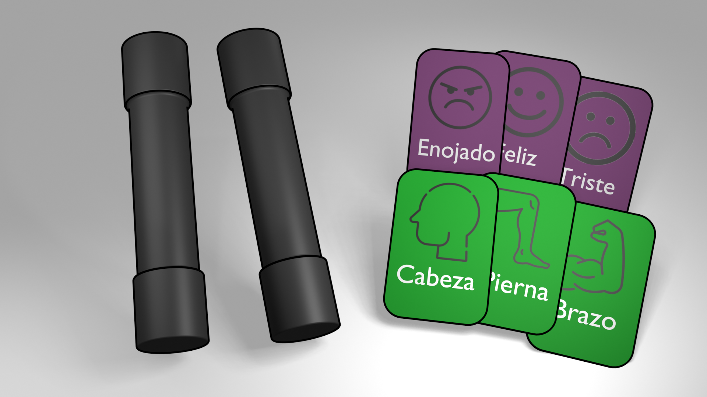

<!-- 
To-do:
* Casi todo
* Usuarios: caracteristicas, necesidades [Andrés]
* Rehacer la matriz Pugh (Esta incoherente)
* Ideas proyectuales [Trincado]
-->

# Introducción
<!-- WIP -->

# Contexto del problema
Este proyecto es parte de la asignatura Taller VI de la carrera
Ingeniería en Diseño de Productos, de la UTFSM. Esta asignatura es, a su vez, 
una continuación del trabajo realizado en Taller V; en el cual los estudiantes
determinaron necesidades existentes dentro de la *Escuela Especial de 
Desarrollo de La Reina* (En adelante, *La Escuela*), un establecimiento educacional 
diferencial de organización municipal situado en la ciudad de Santiago. 
*La Escuela* fue generosa en compartir sus actividades, experiencias, conocimientos,
y disponibilidad de sus alumnos.

El objetivo de Taller VI es reconocer, y desarrollar nuevas soluciones en
el área de inclusión; utilizando a *La Escuela* como espacio de investigación
y testeo.

<!-- WIP -->

# Equipo de trabajo
El equipo consta de cuatro individuos:

 - **Andrés Hechenleitner:** Implementador. Actúa simultáneamente como
   líder de Investigación Aplicada, y mantenedor de documentación.
   
 - **Luciano Roque:** Cohesionador. Actúa como encargado de
   Secretaría, y Comunicaciones.
   
 - **Vicente Trincado:** Especialista. Líder de investigación básica,
   y redacción de documentación.
   
 - **Ricardo Valdés:** Monitor Evaluador. Es el evaluador principal
   del proyecto, participa en todas las esferas para velar por la
   buena ejecución del proyecto. Además es líder de investigación
   secundaria.
<!-- Sacado directamente de overview.md -->
<!-- WIP -->

# Objetivos del proyecto
El actual proyecto nace a partir de los deseos del equipo de continuar
estudiando la base de usuarios observada en el taller pasado; a saber, 
niños TEA de enseñanza básica. Y a la vez, estudiar estudiar aspectos
de bienestar emocional.

Definimos, entonces, los objetivos del proyecto de la siguiente forma:

> **Objetivo General**  
> Mejorar la convivencia en recreo entre niños con TEA, para mejorar su bienestar emocional a través de actividades de juego.

> **Objetivo Específico 1**  
> Desarrollar actividades de juego que propicien el alfabetismo en
> salud mental en niños.
 
> **Objetivo Específico 2**  
> Brindar herramientas que faciliten dinámicas de interacción social
> enriquecedora en recreo.
 
> **Objetivo Específico 3**  
> Desarrollar reconocimiento emocional propio desde la propiocepción,
> y la cinestesia; a través del juego en recreo
 
# Usuario: Características y necesidades
<!-- WIP -->
Para tener un entendimiento más completo de nuestro usuario es necesario especificar en profundidad los factores que lo componen. Para esto, se presentan a continuación sus características y necesidades

**Características del usuario:**
- Preadolescentes de 9 a 12 años
- Presenta Nivel de gravedad TEA, Grado 1 (Según descrito en el DSM-5)
- Cursa ^3ro^ a 6^to^ básico en una escuela especial
- Tiene amistades TEA
- Posee un Coeficiente Intelectual superior o igual a 80
- Presenta una alta incidencia de comorbilidades
- Presenta una disfunción en el sistema de recompensas
- Posee una lenta capacidad de habituación

  
**Necesidades del usuario:**
- Desarrollar habilidades sociales
- Desarrollar habilidades de reconocimiento de emociones
- Estimular y desarrollar la propiocepción y la cinestesia

# Estado del arte y referentes
<!-- WIP -->
## Tazos:
Son figuras circulares los cuales muestran una imagen asociados a distintas tematicas (Por lo general caricaturas para llamar la atencion de los niños). Su uso consiste, ademas de tener un aspecto coleccionable, en apostar tazos situandolos en el piso junto a la apuesta del contrincante y lanzar un tazo de su arsenal para intentar dar vuelta los tazos de apuesta. Aquel que logre darle la vuelta a uno mas tazos gana los que hayan sido volcados sobre su cara.

Una adaptacion de esta idea para nuestro objetivo seria la de demostrar una emoción y una parte del cuerpo. 

## Dixit:
Juego de mesa en el cual el objetivo es adivinar una carta a partir de una pista entregada en forma de frase o narracion.

La adaptacion de este referente consistiria en cartas que muestran distintos escenarios en los cuales el usuario tiene que identificar las emociones producidas.

## Chi Kung:
Terapia medicinal tradicional china, centrada en la regulación de la respiración en conjunto de una serie de movimientos enlazados, muy similar a la realización del Tai chi.

La adaptación del chi kung se encuentra en la propiocepción al momento de realizar los distintos movimientos.

# Oportunidad visualizada
<!-- WIP -->
A través de las investigaciones realizadas se logro identificar la falta de herramientas de ayuda emocional, y la propención a la depresión y la ansiedad de personas TEA, identificando la siguiente oportunidad:

Brindar conocimientos sobre salud mental para generar herramientas preventivas contra transtornos emocionales

# Necesidades específicas
 1. Ergonomía
 1. Familiaridad
 1. Sociabilidad
 1. Seguridad
<!-- WIP -->

# Ideas proyectuales

## Discos
Muestran una emoción y una parte del cuerpo. 
El usuario debe representar la emoción a través de sus expresiones verbales y no verbales.

## "Dixit"
Cartas que muestran distintos escenarios actuados en los cuales el usuario tiene que identificar las emociones producidas.

## Formas en Pareja
Coreografía de pares que permite el desarrollo de la propiocepción y la comunicación de emociones en base al movimiento.

# Evaluación de propuestas

Luego de realizar la matriz Pugh pudimos evaluar las propuestas entre ellas usando al QiGong o Chi Kung como la base de dicha evaluación. Gracias a esto nos percatamos que la mas compatible entre ellas es el Baile Cooperativo y debajo de esta se encuentran los Discos Emocionales y los Tazos Emocionales.

Como equipo decidimos evaluar también la fusión de ambas actividades, primero de forma directa sumando la puntuación de cada juego para describir su fusión y luego con un análisis mas centrado en nuestra idea: La Posta Emocional. De esta forma nos encontramos con una propuesta que es igual de efectiva que el Chi Kung en algunos aspectos pero superior a el en otros.
<!-- WIP (Andrés)-->

# Entregables de trabajo
<!-- WIP -->

# Requerimientos de diseño
<!-- WIP -->
- **Estimulación del sistema vestibular:**  
  El producto debe aumentar la estimulación sensorial y la propiocepción del usuario.
  
- **Propicia reflexión emocional:**  
  El producto debe propiciar que el usuario pueda identificar sus propias emociones dando enfasis a emociones básicas (ira, alegría y tristeza).
  
- **Producir actividad física y lúdica:**  
  El producto debe incentivar la actividad física para su correcto uso.
  
- **Aumentar la interacción social efectiva:**  
El producto debe aumentar la interacción y comunicación entre los usuarios del producto.

# Render de la maqueta

<!-- WIP -->

# Prototipo Alpha realizado
<!-- WIP (Vicente)-->

<!-- WIP -->

# Anexos
<!-- WIP -->
## Imágen de prototipo Alpha de mancuerna

# Bibliografía
<!-- WIP -->

